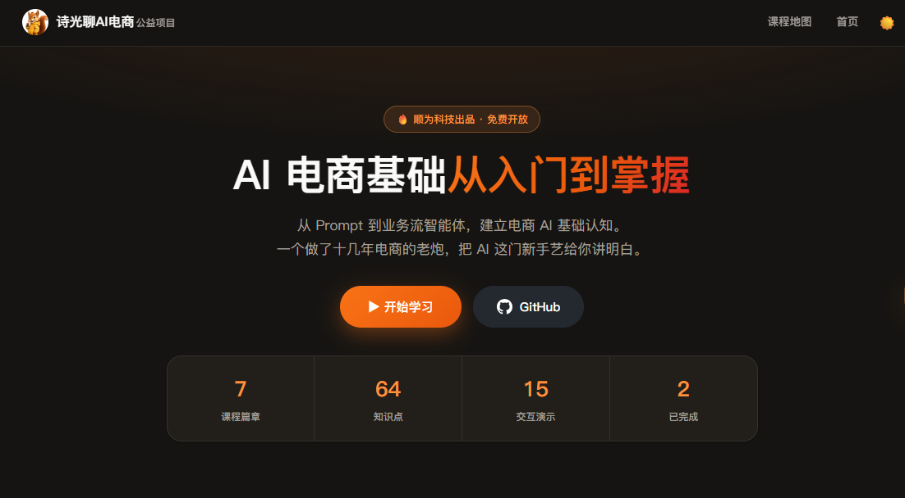
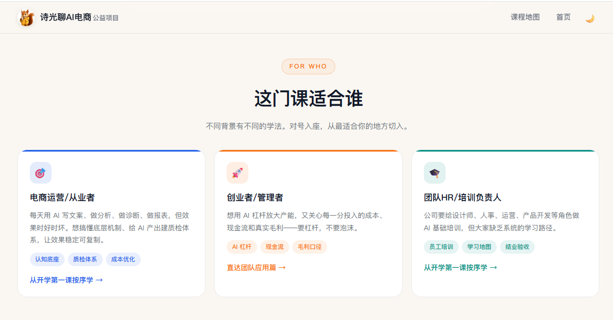

# 《AI 电商基础从入门到掌握》公益课程网站

**诗光聊AI电商 公益项目 · 顺为科技出品**

一门给电商人看的 AI 基础课：**64 个交互知识点、7 大篇章**，从 Prompt 底层一路讲到业务流智能体，全部免费、点开就学、不用报名。

## 🔗 直达

- **课程网站：<https://sgxueai.com>**
- 配套 Skill 库：[github.com/sgskills/aibp](https://github.com/sgskills/aibp) —— 电商人必备好用的 Skill 库，复制该段文字发给 AI 安装

## 📸 长什么样

| 网站首页 | 课程地图 |
|---|---|
|  |  |

## 📚 课程结构

| 篇章 | 内容 |
|---|---|
| 导学篇 | 为什么电商人要懂 AI 底层、这门课怎么学 |
| 第一篇章 · AI 认知底座 | Prompt 工程、温度、上下文、幻觉防御、知识库 |
| 第二篇章 · 业务流智能体设计 | Agent 四大能力、工具调用、ReAct 循环、权限与安全 |
| 第三篇章 · 电商 AI 落地实战 | AI 生图流水线、产品特征提取、店铺知识库、客服 Agent |
| 第四篇章 · 规模化运营 | 多 Agent 协作、数据看板、效能优化、模型选型 |
| 第五篇章 · 团队与规范 | 质量验收、SOP 模板、提示词版本管理、AI 型团队 |
| 加餐篇 · 团队应用加餐 | 选品、测款、现金流、毛利口径、团队 AI 落地 |

学完全部 64 节才能进结业考试，90 分过线，考过可生成带唯一编号的**结业证书**（名字自己填）。

## ✨ 特点

- **纯交互课件**：没有视频，全部是可拖、可点、可算的网页交互演示
- **电商场景翻译**：每个技术概念都译成电商话——店规、岗位说明书、交接班记录
- **零门槛**：不需要会写代码，面向做生意的人
- **真门槛**：64 节逐节学完才能考试，没有代打卡

## 🛠 技术

纯静态站，无框架无构建，打开 `index.html` 即整个网站。

- 托管：Cloudflare Pages（连本仓库，`main` 分支 push 后约 1 分钟自动部署）
- 统计：百度统计
- 维护指南：见 [AGENTS.md](AGENTS.md)（AI 协作者入职手册）

## 🤝 参与

发现错别字、内容纰漏或想补充电商实战案例，欢迎提 Issue 或 PR。

## 📮 关注「诗光聊AI电商」

公众号持续更新 AI 电商实战内容，扫码关注：

---

鸣谢：洛小山 · 公益 AI 学习网站 [xueai.app](https://xueai.app)
